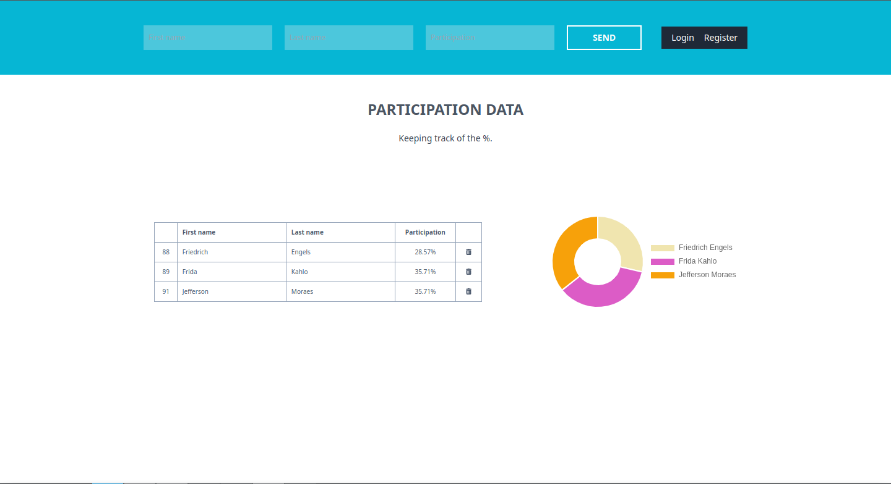
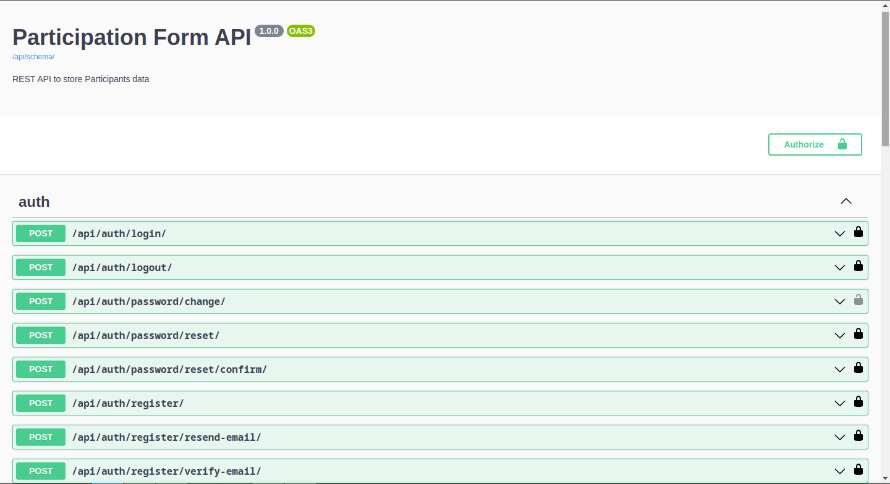
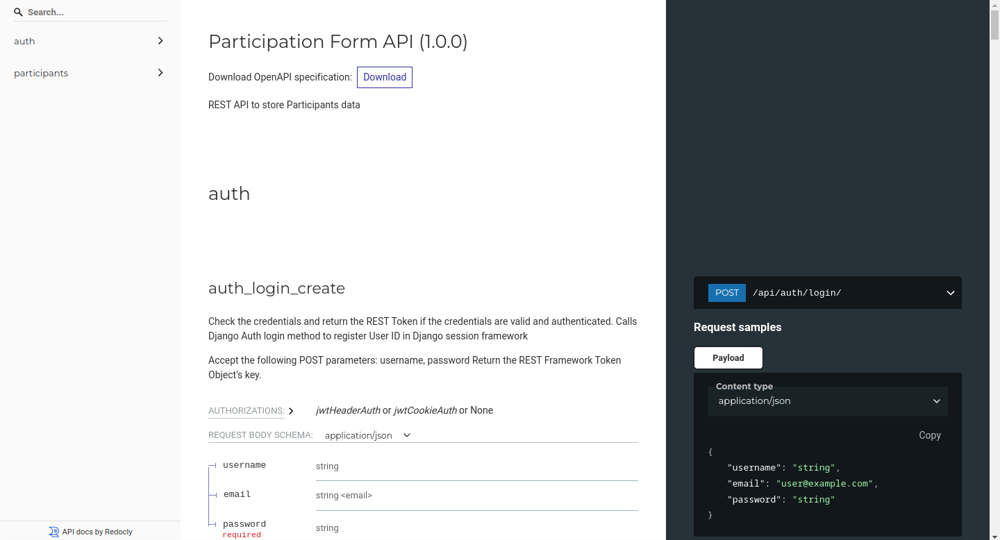

# cotabox-challenge

Desafio técnico para a vaga de Desenvolvedor Full Stack @ Cotabox

## Sumário

- [Overview](#overview)
  - [Screenshots](#screenshots)
- [Features](#features)
- [Tecnologias Utilizadas](#tecnologias-utilizadas)
- [Instalação](#instalacao)
- [Uso](#compile-and-minify-for-production)
- [Autor](#autor)

## Overview

### Screenshots

- Main page ('/')

- API Swagger UI ('/api/schema/swagger-ui/')

- API Redoc UI

### Features
- Autenticação de usuário: Os usuários podem se registrar e fazer login para acessar a funcionalidade do aplicativo.
- Registro de Participação: Usuários autenticados podem registrar participantes por meio de um formulário simples. O aplicativo calculará a porcentagem que cada participação representa em relação ao número total de participações.
- Visualização de Dados: O aplicativo exibe uma tabela e um gráfico de rosca para fornecer aos usuários uma representação visual de suas participações.

### Tecnologias Utilizadas
- Front-end
    - Vue
    - Vite
    - TailwindCSS
- Back-end
    - Django
    - Django REST Framework
    - PostgreSQL
- Deployment
    - Docker
    - docker-compose
    - nginx

### Instalação
- Clone o repositório em sua máquina local.
- Certifique-se de ter o Docker e o docker-compose instalados.
- Execute "docker-compose up" (ou docker compose up, dependendo da versão) no diretório raiz do projeto.
- Acesse o aplicativo em http://localhost:5173.

### Uso
- Registre-se ou faça login no aplicativo.
- Preencha o formulário de participação e envie-o.
- Visualize suas participações registradas na tabela e no gráfico de rosca.

#### Autor
- Rodrigo Bezerra Saraiva
